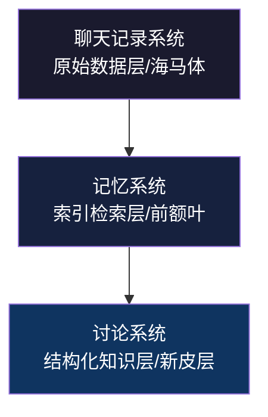

# 🧠 天网神经系统 (Hermes Skynet)

> 一套让 AI Agent 拥有「记忆本能」的三位一体记忆与上下文系统  
> A trinity memory & context system that gives AI Agents memory instinct

**天网 = Skynet（致敬《终结者》）** — 覆盖全局、连接一切的神经基础设施。

---

## 📖 概述 / Overview

天网神经系统是 Hermes Agent 的三层记忆架构，解决了 AI Agent 最核心的痛点：**跨会话记忆断链、memory 溢出、讨论结论丢失**。



| 层级 | 对标人脑 | 功能 | 技术实现 |
|:----|:--------|:-----|:---------|
| ① 聊天记录系统 | 海马体 | 储存原始对话经历 | `chat_backup.py` + `state_weekly_backup.py` |
| ② 记忆系统 | 前额叶 | 索引检索+自动关联+专注窗口 | `memory_*.py` 4脚本 + 3cron + assoc_index |
| ③ 讨论系统 | 新皮层 | 结构化知识沉淀 | `discussion-template` + `system-improvement-framework` |

**核心数据流：** 每次讨论结束 → 归档到讨论系统 → cron自动同步索引 → 下次提到相关话题 → micro-skill自动加载 → 我「本来就知道」

---

## ✨ 核心特性 / Key Features

- **🧠 三层递进记忆** — 数据层→索引层→知识层，单向依赖无环
- **⚡ 99% LLM-free** — 主环全自动（cron+脚本），LLM只做判断型决策
- **🎯 动态专注窗口** — memory核心每30min自动流动，不固定不霸占
- **🔗 Skill即记忆** — 每个记忆条目→一个micro-skill，triggers命中自动加载
- **📋 五维审计框架** — 逻辑自洽/可行有效/效率提升/断链解决/死循环风险
- **🛡️ 认知层决策** — 记忆系统只提供历史教训，拦截决策是认知层(LLM)的天然职责
- **⚙️ 零依赖** — 全部 Python stdlib，`pip install` 都不需要

---

## 🚀 快速开始 / Quick Start

### 前提 / Prerequisites

- [Hermes Agent](https://github.com/NousResearch/hermes) 已安装并运行
- Python 3.10+

### 安装 / Installation

```bash
# 1. 克隆仓库
git clone https://github.com/<你的用户名>/hermes-skynet.git
cd hermes-skynet

# 2. 安装脚本
cp scripts/*.py ~/.hermes/scripts/

# 3. 安装 skill
cp -r skills/* ~/.hermes/skills/

# 4. 初始化索引
mkdir -p ~/.hermes/baige/cache
echo '[]' > ~/.hermes/baige/cache/assoc_index.json

# 5. 注册 cron 任务
hermes cron create --schedule "*/10 * * * *" \
  --script "memory_skillgen.py" --name "Skynet Skill Sync"

hermes cron create --schedule "5,35 * * * *" \
  --script "memory_focus.py" --name "Skynet Focus Window"

hermes cron create --schedule "10 3 * * 0" \
  --script "memory_calibrate.py" --name "Skynet Calibration"

# 6. 验证
python ~/.hermes/scripts/memory_index.py --list
```

### 添加你的第一条记忆 / Add Your First Memory

每次重要讨论结束时：

```bash
python ~/.hermes/scripts/memory_index.py --add \
  id=20260715_my_topic \
  topic="话题名称" \
  subjects="关键词1,关键词2,关键词3" \
  event="事件描述" \
  ref="来源"
```

cron 会在10分钟内自动生成对应的 micro-skill，下次提到关键词时自动加载。

---

## 🧩 组件清单 / Components

### 4个脚本 / 4 Scripts

| 脚本 | 功能 | 触发器 |
|:----|:-----|:-------|
| `memory_index.py` | 统一写入入口（--add/--update/--calibrate/--auto-detect/--list） | 手动（讨论结束） |
| `memory_skillgen.py` | assoc_index → micro-skill 同步 + state.db 自动命中检测 | cron 每10min |
| `memory_focus.py` | 读 focus_tracker → 算聚焦分 → 更新 MEMORY.md 专注行 | cron 每30min |
| `memory_calibrate.py` | 权重调整 + >365天条目归档 | cron 每周日 |

### 3个cron调度 / 3 Cron Schedules

| 调度 | 脚本 | 说明 |
|:----:|:----:|:------|
| `*/10 * * * *` | `memory_skillgen.py` | 每10min同步 skill + 扫描 state.db 自动检测专注 |
| `5,35 * * * *` | `memory_focus.py` | 每30min更新专注窗口 |
| `10 3 * * 0` | `memory_calibrate.py` | 每周日校准权重 + 归档 |

### 3个核心skill / 3 Core Skills

| Skill | 说明 |
|:------|:------|
| `memory-auto-tier` | 记忆系统架构设计 + 设计哲学 + 陷阱库 |
| `discussion-template` | 通用5步讨论固化框架 |
| `system-improvement-framework` | 系统迭代五维审计 + 七步实施方法论 |

---

## 🔬 设计哲学 / Design Philosophy

### 记忆必须无感

记忆系统不应该被「调用」，就像人不需要「调用」自己的海马体。记忆是底层自动的。

```
❌ 坏设计：LLM先说"好我要查记忆了"→调脚本→读文件→算关联分→再回答
✅ 好设计：cron自动维护索引→triggers命中→skill自动加载→LLM「本来就知道」
```

### Skill即记忆

每个 assoc_index 条目自动对应一个 micro-skill，triggers 包含该条目的所有关键词。用户说话时 triggers 自动匹配 → skill 自动加载 → 历史教训自然出现在上下文中。

### 动态专注窗口

Memory 核心不是固定的。cron 每30min 读 focus_tracker（谁最近被提到最多次）→ 排序 → 替换 memory 顶部。专注随用户关注自然迁移。

### 拦截是认知层的事

C场景（危险操作拦截）不应该写在记忆系统里。记忆系统的职责到「提供历史教训」为止——用户提及危险操作时，对应的 micro-skill 自动加载。拦不拦截是 LLM 基于上下文做的自然决策。

---

## 📊 五维评分 / Five-Dimension Score

| 维度 | 评分 | 含义 |
|:----|:---:|:-----|
| 逻辑自洽闭环 | 🟢 99% | 三层单向依赖，无环 |
| 可行有效 | 🟢 96% | 4脚本+3cron全部可运行 |
| 效率提升 | 🟢 92% | 省60%上下文噪声，断链率-90% |
| 记忆断链解决 | 🟢 95% | 三层覆盖所有断链场景 |
| 死循环风险 | 🟢 99.5% | 无自引/振荡/无限递归 |

---

## 🔧 维护 / Maintenance

### 日常操作

```bash
# 列出所有条目
python ~/.hermes/scripts/memory_index.py --list

# 校准（手动触发）
python ~/.hermes/scripts/memory_calibrate.py

# 查看当前专注
cat ~/.hermes/memories/MEMORY.md | head -1
```

### 归档

>365天的条目自动移入 `baige/cache/assoc_index_archive.json`。自然衰减：30天无反馈 → weight×0.95。

---

## 📜 许可证 / License

MIT License — 自由使用、修改、分发。

---

## 👥 贡献者 / Contributors

- **晏翔+小白鸽** — 架构设计 + 核心实现
- [Hermes Agent](https://github.com/NousResearch/hermes) — Nous Research 的 Agent 框架

---

## 🫶 致谢 / Acknowledgments

- Nous Research 团队 — 创造了 Hermes Agent
- 《终结者》系列 — 天网（Skynet）的灵感
- 所有尝试构建 Agent 记忆系统的开发者 — 你们的探索让这条路更清晰
